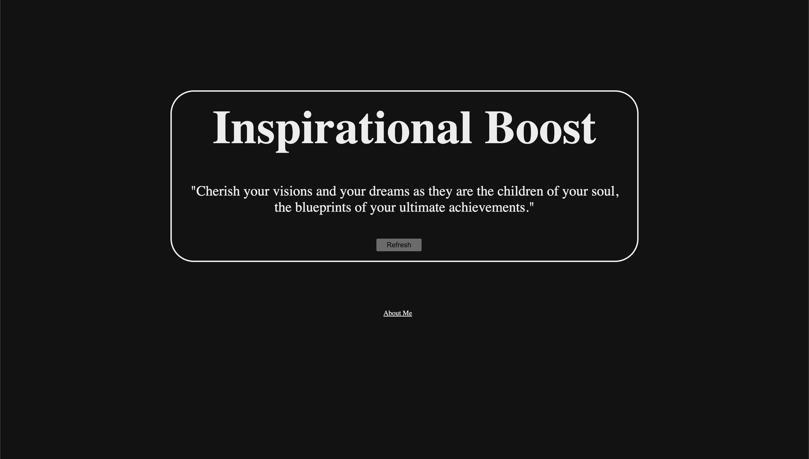
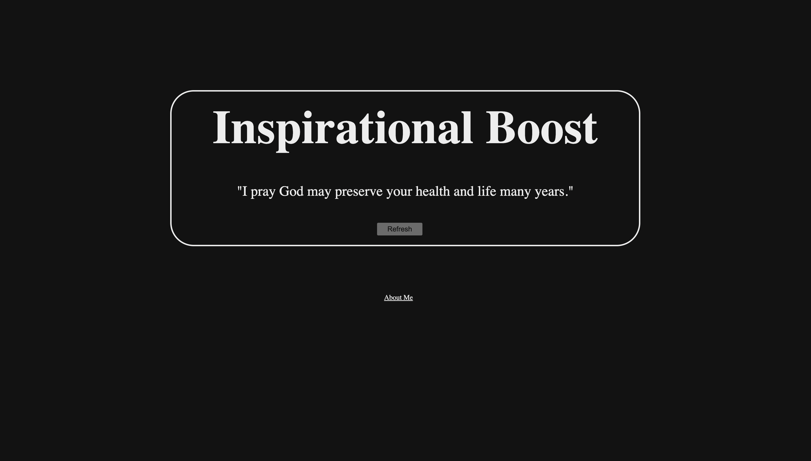

# Inspirational Boost

This is a web application I've built using NextJS/React with HTML & CSS which utilizes a couple of APIs.

### The Premise:

Some days I feel like I’m drained, like I need a boost. So I thought to myself, why not have a site that gives me a new positive and inspiring quote when I need it.

## How Does This Work?
This app makes a couple of API calls to first, load in a list of quotes and second, to analyze the emotions in the quotes. This is achieved using an Emotion Analysis API and a Quotes API. With this information, the quotes are then compared based on how much "joy" they have. In the end, I only focus on the quote with the highest score for "joy".

A refresh button is included, that underneath the interface, changes a state variable that is being watched. Upon being changed, it causes the API calls in React's useEffect() hook to run again, hence a refresh.

## 

---

